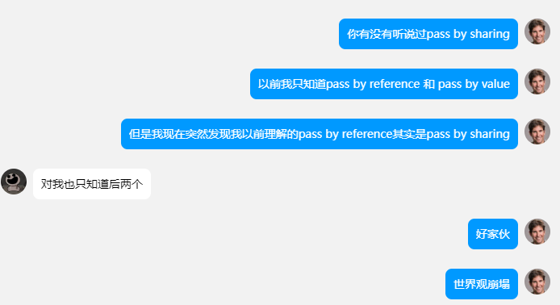

# Object in JS

JS有8种数据类型，其中7种是原始类型，最后一种就是对象。

JS中对象的分类：

- 内建对象：由ES标准所定义的对象，如Funciton, String, Number, Object..
- 宿主对象：由浏览器提供的对象，BOM, DOM
- 自定义对象

JS中的对象可以看作是属性的集合，一个属性就是一个`key:value`的键值对，其中key是一个字符串或symbel（也叫做属性名），value可以是任何类型（比如可以是函数，这样的属性就叫做方法）。

## 1. 创建对象

在JS中有两种创建对象的方法：

第一种是通过调用类的构造函数来创建，就像在Java中那样：

```javascript
let myCat = new Object(); //调用类的构造函数
```

第二种是用JS的字面量语法：

```javascript
let cat = {}; //"字面量"的语法
```

创建完一个对象以后，有两种访问其属性的方法：dot notation（`cat.key`）和方括号（`cat[key]`）。其中，方括号的方式可以从变量中获取key。

若要遍历对象的key，可以用`for ... in`，不过这种方法会把对象从原型中继承的属性也遍历了。而除此之外的几乎所有遍历属性的方法，如`Object.keys`，`Object.values`等，都会忽略掉继承来的属性。

```javascript
for (let key in cat) {
    alert(key);
    alert(cat[key]);
}
```

## 2. constructor, `new`

通过构造函数和`new`实现的上文第一种创建对象的方法：

```javascript
function Cat(name) {
    this.name = name;
    this.isNeutered = false;
}  //其实就像在创建一个类的时候，写其中的constructor一样。
//以及，不管是写在类里面的构造函数，还是此处这样直接定义的构造函数，里面的this都是表示要新创建的对象。

let myCat = new Cat("malou");
```

除了箭头函数（因为它没有自己的 `this`），其实任何函数都可以是构造函数，换句话说就是可以用`new`来调用。不过按照惯例，如果要写一个constructor，首字母要大写。

当一个函数用`new`来调用时，实际上是在该函数运行时，函数内部使用 `this` 关键字来引用新创建的对象，随后根据函数体里写好的代码来给这个this对象添加属性和方法，以此来初始化对象。箭头函数不能用作构造器函数，也正是因为它不支持 `this` 绑定。

相较于直接用字面量创建对象，构造函数和`new`能够让对象的创建得到复用。这实际上是JS早期创建类的方式，现在还是直接用`class`来创建比较好，但是了解这样旧的写法也能够帮助理解JS中`constructor`和原型的运行机制（后面还会看到这一块内容哒，在3-1的部分）。

# JS中的对象引用和复制

> 对象与原始值的根本区别之一在于，对象是“通过引用”存储和复制的，而原始值等总是“作为一个整体”复制。
>

## 1. 对象的引用

一开始我觉得这就是pass by reference（其实是指针的复制） 和 pass by value的区别，查了一下发现还有pass by sharing的区分？开始疯狂挠头。关于JS中的这一点（Python也一样），感觉比较清楚的回答是[下面这个](https://stackoverflow.com/a/38533677/24989889)（像是刚学Python时，去tutor上跑一下就能回忆起来）：

>
> Function arguments are passed either by-value or by-sharing, but never **ever** by reference in JavaScript!
>
> ## Call-by-Value
>
> Primitive types are passed by-value:
>
> ```js
> var num = 123, str = "foo";
> 
> function f(num, str) {
>   num += 1;
>   str += "bar";
>   console.log("inside of f:", num, str);
> }
> 
> f(num, str);
> console.log("outside of f:", num, str);
> ```
>
> **Reassignments** inside a function scope are not visible in the surrounding scope.
>
> ## Call-by-Sharing
>
> Objects, that is to say all types that are not primitives, are passed by-sharing. A variable that holds a reference to an object actually holds merely a copy of this reference. If JavaScript would pursue a *call-by-reference* evaluation strategy, the variable would hold the original reference. This is the crucial difference between by-sharing and by-reference.
>
> What are the practical consequences of this distinction?
>
> ```js
> var o = {x: "foo"}, p = {y: 123};
> 
> function f(o, p) {
>   o.x = "bar"; // Mutation
>   p = {x: 456}; // Reassignment
>   console.log("o inside of f:", o);
>   console.log("p inside of f:", p);
> }
> 
> f(o, p);
> 
> console.log("o outside of f:", o);
> console.log("p outside of f:", p);
> ```
>
> **Mutating** means to modify certain properties of an existing `Object`. The reference copy that a variable is bound to and that refers to this object remains the same. Mutations are thus visible in the caller's scope.
>
> **Reassigning** means to replace the reference copy bound to a variable. Since it is only a copy, other variables holding a copy of the same reference remain unaffected. Reassignments are thus not visible in the caller's scope like they would be with a *call-by-reference* evaluation strategy.

上文Call-by-Sharing中的例子，在Python中也是同样的结果。感觉很合理，这个时候看下面这个回答也觉得是合理的但没必要把概念绕到这个样子：

> Primitives are passed by value, and Objects are passed by "copy of a reference".
>
> Specifically, when you pass an object (or array) you are (invisibly) passing a reference to that object, and it is possible to modify the *contents* of that object, but if you attempt to overwrite the reference it will not affect the copy of the reference held by the caller - i.e. the reference itself is passed by value:
>
> ```js
> function replace(ref) {
>     ref = {};           // this code does _not_ affect the object passed
> }
> 
> function update(ref) {
>     ref.key = 'newvalue';  // this code _does_ affect the _contents_ of the object
> }
> 
> var a = { key: 'value' };
> replace(a);  // a still has its original value - it's unmodfied
> update(a);   // the _contents_ of 'a' are changed
> ```

## 2. 对象的复制

普通数据类型拷贝的是值本身，而对象类型拷贝的是对象的引用。

对象通过引用被赋值和拷贝。此时一个变量存储的不是“对象的值”，而是一个对值的“引用”（内存地址）。因此，浅拷贝此类变量或将其作为函数参数传递时，拷贝的是引用而非对象本身。所有通过浅拷贝引用的操作（如添加、删除属性）都作用在同一个对象上。

如何在JS中做深拷贝似乎算是常见的面试题，真正的深拷贝API是`_.cloneDeep(obj)`，用递归来检查`Obj[key]`（想要拷贝的对象）的每个值是不是还是对象。关于JS中对象复制更详细的解释，详见[JS现代教程](https://zh.javascript.info/object-copy)。

## *关于pass by value/reference更多的讨论



好吧，我能很明白pass by value和所谓pass by sharing，但还是感觉很奇怪，或许应该通过C/C++来更深刻地理解pass by reference（今天学到了值语义（改变一个对象的副本不应该改变这个对象及其其他副本）&引用语义）。不过[这个回答](https://stackoverflow.com/a/430958/24989889)让我满意和安心。

# 属性的配置

对象属性除了显性的`key:value`之外，还有三个特殊的可配置的选项：

- `writable`：该属性`value`是否可以被修改；
- `enumerable`：该属性是否会被在遍历中被枚举到；
-  `configurable`：该属性是否可以被删除，以及这三个配置选项是否可以被修改。

当我们用正常的方式创建属性时，这三个选项的值都默认为`true`。

# 访问器属性：Getter & Setter

JS中，对象的属性有两种，一种是数据属性，大多数`key:value`的属性都是数据属性；另一种是访问器属性。访问器属性的作用其实就是获取和设置对象某属性的值，分别是Getter和Setter。为什么在数据属性之外，还需要访问器属性捏？见下例：

```javascript
let user = {
  name: "John",
  surname: "DeNero",

  get fullName() { //这是fullname的getter
    return `${this.name} ${this.surname}`;
  }
    
  set fullName(value) { //这是fullname的setter
    [this.name, this.surname] = value.split(" ");
  }    
};

alert(user.fullname); //虽然访问器属性调用了函数，但是却可以用属性的方式来获取，而不是调用方法
//如果不用访问器，而是写一个单纯的fullname()方法用来获取对象的fullname，那么就要用user.fullname()来调用，
//相比访问器属性来说就不那么好看，因为fullname在逻辑上应该是对象的一个属性啦。
```

访问器属性的作用：1、可以不用方法的方式调用`user.fullname`，而是像访问属性那样读取它。2、更重要的作用，是Getter和Setter里还可以写一些额外的逻辑，确保对属性的访问/设置/修改符合特定的规则和条件。


